# 🏗️ Smart Context Diagram (SCD) - AuditorIA

## Diagrama de Contexto C4 - Arquitectura AuditorIA

```mermaid
graph LR
    %% Definir estilos
    classDef userStyle fill:#e1f5ff,stroke:#01579b,stroke-width:2px,color:#000
    classDef systemStyle fill:#f3e5f5,stroke:#4a148c,stroke-width:2px,color:#000
    classDef aiStyle fill:#fff3e0,stroke:#e65100,stroke-width:3px,color:#000
    classDef dbStyle fill:#e8f5e9,stroke:#1b5e20,stroke-width:2px,color:#000
    classDef externalStyle fill:#fce4ec,stroke:#880e4f,stroke-width:2px,color:#000
    classDef vectorStyle fill:#fff9c4,stroke:#f57f17,stroke-width:2px,color:#000
    classDef etlStyle fill:#e1bee7,stroke:#6a1b9a,stroke-width:2px,color:#000

    %% === COLUMNA IZQUIERDA: EXTERNO Y ETL ===
    subgraph LeftCol[" "]
        direction TB
        GLPI["🔌 GLPI<br/>Hardware • Software"]
        ModuloETL["🔄 Módulo ETL<br/>Extract • Transform • Load"]
        MySQL["🗄️ MySQL<br/>Activos • Riesgos"]
    end
    
    class GLPI externalStyle
    class ModuloETL etlStyle
    class MySQL dbStyle

    %% === COLUMNA CENTRAL: APLICACIÓN ===
    subgraph CenterCol[" "]
        direction TB
        GestorRiesgos["👤 Gestor de Riesgos"]
        Frontend["⚛️ Frontend React<br/>Wizard • Dashboard"]
        BackendAPI["🔧 Backend API<br/>REST Services"]
    end
    
    class GestorRiesgos userStyle
    class Frontend systemStyle
    class BackendAPI systemStyle

    %% === COLUMNA DERECHA: IA Y VECTOR ===
    subgraph RightCol[" "]
        direction TB
        MotorRAG["🤖 Motor RAG / IA<br/>Sugerencias ISO<br/>Justificaciones"]
        VectorDB["📊 Vector DB<br/>Embeddings ISO"]
    end
    
    class MotorRAG aiStyle
    class VectorDB vectorStyle

    %% === CONEXIONES VERTICALES EN CADA COLUMNA ===
    GLPI -->|"MySQL/SQL"| ModuloETL
    ModuloETL -->|"SQL INSERT"| MySQL
    
    GestorRiesgos -->|"HTTPS/JSON"| Frontend
    Frontend -->|"HTTPS/JSON"| BackendAPI
    
    MotorRAG -->|"API/Embeddings"| VectorDB
    VectorDB -->|"Vectores"| MotorRAG

    %% === CONEXIONES HORIZONTALES ENTRE COLUMNAS ===
    BackendAPI -->|"HTTP/JSON"| MotorRAG
    MotorRAG -->|"HTTP/JSON"| BackendAPI
    BackendAPI -->|"SQL/ORM"| MySQL
    MySQL -->|"ResultSet"| BackendAPI

    %% Estilo de las flechas
    linkStyle 0 stroke:#880e4f,stroke-width:2px
    linkStyle 1 stroke:#6a1b9a,stroke-width:2px
    linkStyle 2 stroke:#01579b,stroke-width:2px
    linkStyle 3 stroke:#4a148c,stroke-width:2px
    linkStyle 4 stroke:#e65100,stroke-width:3px
    linkStyle 5 stroke:#f57f17,stroke-width:2px
    linkStyle 6 stroke:#e65100,stroke-width:3px
    linkStyle 7 stroke:#e65100,stroke-width:3px
    linkStyle 8 stroke:#1b5e20,stroke-width:2px
    linkStyle 9 stroke:#1b5e20,stroke-width:2px
```

---

## 📋 Descripción de Componentes

### 👤 Gestor de Riesgos
**Rol**: Usuario principal del sistema que gestiona activos, evalúa riesgos y consulta dashboards.

### 🛡️ AuditorIA (Sistema Central)
**Descripción**: Plataforma integral para la gestión de riesgos de seguridad de la información.

### ⚛️ Frontend React
**Tecnologías**: React 18+, TypeScript, Material-UI, React Query

### 🔧 Backend Flask API
**Tecnologías**: Flask 2.3+, SQLAlchemy, PyJWT, Flask-CORS

### 🤖 Motor RAG / Servicio de IA
**Tecnologías**: Python, LangChain, LlamaIndex, sentence-transformers

### 🗄️ Base de Datos MySQL
**Versión**: MySQL 8.0+

### 📊 Base de Datos Vectorial
**Tecnologías**: ChromaDB / Pinecone (propuesto), sentence-transformers

### 🔄 Módulo ETL
**Descripción**: Módulo Extract, Transform, Load para sincronización de datos desde GLPI

**Funcionalidades**:
- **Extract**: Extracción de datos desde GLPI (Hardware, Software, Usuarios)
- **Transform**: Transformación y mapeo de datos al esquema de AuditorIA
- **Load**: Carga de datos transformados en MySQL

**Scripts ETL**:
- `etl_computers.py` - Extracción y carga de activos hardware
- `etl_softwares.py` - Extracción y carga de software
- `etl_users.py` - Extracción y carga de usuarios
- `etl_computer_software.py` - Relaciones activo-software
- `run_etl_full.py` - Ejecución completa del proceso ETL

### 🔌 GLPI (Sistema Externo)
**Descripción**: Sistema de gestión de activos de TI (IT Asset Management)

---

## 🎨 Convenciones del Diagrama

- **Color Naranja**: Motor RAG / Servicio de IA (componente inteligente destacado)
- **Color Púrpura**: Componentes del sistema AuditorIA
- **Color Verde**: Base de datos MySQL
- **Color Amarillo**: Base de datos vectorial
- **Color Rosa**: Sistemas externos
- **Color Azul**: Usuarios

