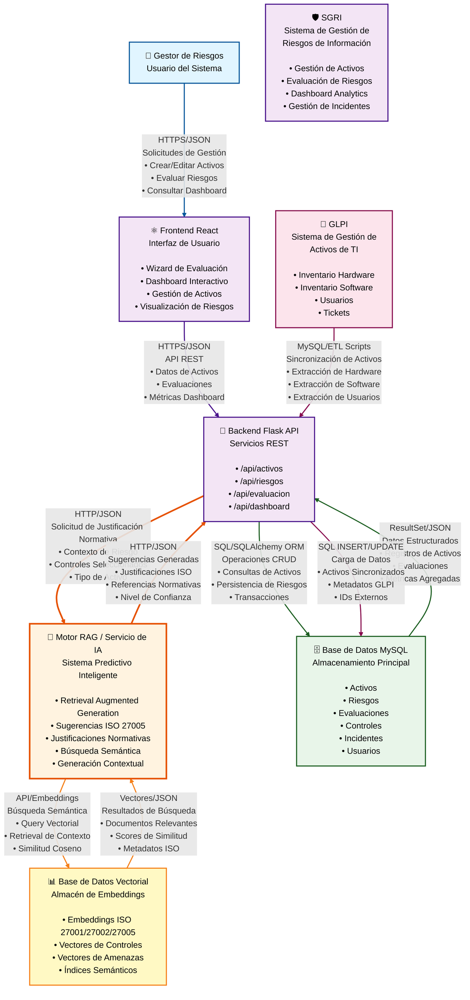

# 🏗️ Smart Context Diagram (SCD) - Sistema SGRI

## Diagrama de Contexto C4 - Arquitectura SGRI



## 📋 Descripción de Componentes

### 👤 Gestor de Riesgos
**Rol**: Usuario principal del sistema que gestiona activos, evalúa riesgos y consulta dashboards.

**Interacciones**:
- Accede al sistema mediante navegador web
- Realiza operaciones CRUD sobre activos y riesgos
- Utiliza el wizard de evaluación paso a paso
- Consulta métricas y visualizaciones en el dashboard

---

### 🛡️ SGRI (Sistema Central)
**Descripción**: Plataforma integral para la gestión de riesgos de seguridad de la información.

**Funcionalidades Principales**:
- Gestión completa de activos de información
- Identificación y evaluación de riesgos
- Dashboard analítico con métricas
- Gestión de incidentes de seguridad
- Cumplimiento normativo (ISO 27001/27002/27005, Marco Legal Colombia)

---

### ⚛️ Frontend React
**Tecnologías**: React 18+, TypeScript, Material-UI, React Query

**Componentes Principales**:
- Wizard de Evaluación Interactivo
- Dashboard con gráficos y métricas
- Gestión de Activos (CRUD)
- Visualización de Matriz de Riesgos
- Panel de Sugerencias Predictivas

---

### 🔧 Backend Flask API
**Tecnologías**: Flask 2.3+, SQLAlchemy, PyJWT, Flask-CORS

**Endpoints Principales**:
- `/api/activos` - Gestión de activos
- `/api/riesgos` - Gestión de riesgos
- `/api/evaluacion` - Evaluación de riesgos
- `/api/predictive/*` - Servicios predictivos
- `/api/dashboard` - Métricas y analytics

---

### 🤖 Motor RAG / Servicio de IA
**Tecnologías**: Python, LangChain, LlamaIndex, sentence-transformers

**Funcionalidades**:
- **Retrieval**: Búsqueda semántica en base de conocimiento ISO
- **Augmented**: Enriquecimiento de contexto con normativa
- **Generation**: Generación de justificaciones basadas en ISO 27005
- Sugerencias inteligentes de amenazas, vulnerabilidades y controles
- Cálculo de niveles de confianza (0-1)

**Endpoints**:
- `/api/predictive/suggestions/threats` - Sugerencias de amenazas
- `/api/predictive/suggestions/vulnerabilities` - Sugerencias de vulnerabilidades
- `/api/predictive/suggestions/controls` - Sugerencias de controles
- `/api/predictive/suggestions/residual-justifications` - Justificaciones residuales

---

### 🗄️ Base de Datos MySQL
**Versión**: MySQL 8.0+

**Tablas Principales**:
- `activos` - Inventario de activos de información
- `riesgos` - Catálogo de riesgos
- `evaluacion_riesgo_activo` - Evaluaciones inherentes y residuales
- `controles_seguridad` - Catálogo de controles ISO 27002
- `incidentes` - Registro de incidentes de seguridad
- `usuarios_sistema` - Usuarios y autenticación

---

### 📊 Base de Datos Vectorial
**Tecnologías**: ChromaDB / Pinecone (propuesto), sentence-transformers

**Contenido**:
- Embeddings de documentos ISO 27001:2022
- Embeddings de documentos ISO 27002:2022
- Embeddings de documentos ISO 27005:2022
- Vectores de controles de seguridad
- Vectores de amenazas y vulnerabilidades
- Índices semánticos para búsqueda rápida

**Operaciones**:
- Inserción de embeddings de documentos procesados
- Búsqueda por similitud coseno
- Retrieval de contexto relevante para RAG

---

### 🔌 GLPI (Sistema Externo)
**Descripción**: Sistema de gestión de activos de TI (IT Asset Management)

**Datos Sincronizados**:
- Hardware (computadoras, servidores, dispositivos)
- Software (aplicaciones, licencias)
- Usuarios del sistema
- Tickets y estados

**Integración**:
- Scripts ETL (`etl_scripts/`) ejecutados periódicamente
- Extracción desde MySQL de GLPI
- Transformación y carga en SGRI
- Sincronización bidireccional de IDs externos

---

## 🔄 Flujos de Datos Principales

### 1. Flujo de Evaluación de Riesgos con RAG
```
Gestor de Riesgos 
  → Frontend (Wizard Step 5: Evaluación Residual)
    → Backend API (/api/predictive/suggestions/residual-justifications)
      → Motor RAG (Context Extraction)
        → Vector DB (Semantic Search)
          → Motor RAG (Generation)
            → Backend API (Sugerencias JSON)
              → Frontend (Mostrar Justificaciones)
                → Gestor de Riesgos (Seleccionar/Editar)
```

### 2. Flujo de Sincronización GLPI
```
GLPI (MySQL)
  → ETL Scripts (Extract)
    → Transform (Mapeo de datos)
      → Backend API (Load)
        → MySQL SGRI (Persistencia)
          → Frontend (Visualización actualizada)
```

### 3. Flujo de Sugerencias Predictivas
```
Frontend (Tipo de Activo seleccionado)
  → Backend API (/api/predictive/suggestions/threats)
    → Motor RAG (Knowledge Base Query)
      → MySQL (Controles ISO 27002)
      → Vector DB (Semantic Matching)
        → Motor RAG (Template Generation)
          → Backend API (Sugerencias con Confianza)
            → Frontend (Cards Interactivas)
```

---

## 🎨 Convenciones del Diagrama

- **Color Naranja (#fff3e0)**: Motor RAG / Servicio de IA (componente inteligente destacado)
- **Color Púrpura (#f3e5f5)**: Componentes del sistema SGRI
- **Color Verde (#e8f5e9)**: Bases de datos
- **Color Amarillo (#fff9c4)**: Base de datos vectorial
- **Color Rosa (#fce4ec)**: Sistemas externos
- **Color Azul (#e1f5ff)**: Usuarios

---

## 📝 Notas Técnicas

1. **Protocolos de Comunicación**:
   - Frontend ↔ Backend: HTTPS/JSON (REST API)
   - Backend ↔ Motor RAG: HTTP/JSON (Servicio interno)
   - Motor RAG ↔ Vector DB: API nativa (ChromaDB/Pinecone)
   - Backend ↔ MySQL: SQL/SQLAlchemy ORM
   - GLPI ↔ Backend: MySQL directo (ETL scripts)

2. **Tipos de Datos**:
   - **JSON**: Todas las comunicaciones API
   - **SQL ResultSet**: Consultas a bases de datos relacionales
   - **Vectores/Embeddings**: Comunicación con base vectorial
   - **Context Objects**: Objetos de contexto enriquecido para RAG

3. **Seguridad**:
   - Autenticación JWT en todas las APIs
   - CORS configurado para Frontend
   - Conexiones MySQL con autenticación nativa
   - Variables de entorno para credenciales

---

**Versión**: 1.0  
**Última Actualización**: 2025-01-12  
**Autor**: Arquitecto de Software SGRI

