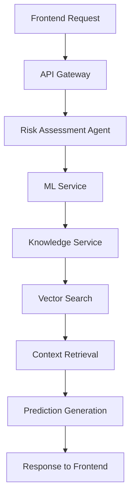
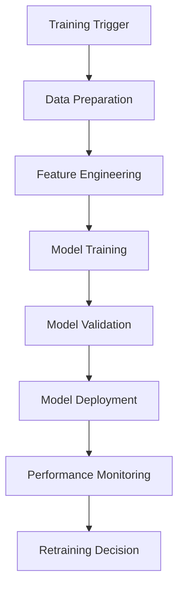

# Arquitectura de Microservicios ML/AI - SGSRI

## 🏗️ Diseño de Arquitectura

### **Estructura Actual vs. Propuesta**

#### **Estructura Actual (Monolítica)**
```
backend/
├── app/
│   ├── routes/          # APIs REST
│   ├── models/          # Modelos de BD
│   └── services/        # Lógica de negocio
```

#### **Estructura Propuesta (Microservicios ML/AI)**
```
backend/
├── app/
│   ├── routes/          # APIs REST existentes
│   ├── models/          # Modelos de BD existentes
│   ├── services/        # Lógica de negocio existente
│   ├── ml/              # 🆕 Servicios ML
│   │   ├── models/      # Modelos de ML
│   │   ├── training/    # Servicios de entrenamiento
│   │   ├── prediction/  # Servicios de predicción
│   │   └── monitoring/  # Monitoreo de modelos
│   ├── agents/          # 🆕 Agentes de IA
│   │   ├── risk_agent/  # Agente de evaluación de riesgos
│   │   ├── control_agent/ # Agente de controles
│   │   └── knowledge_agent/ # Agente de conocimiento
│   ├── knowledge/       # 🆕 Base de conocimiento RAG
│   │   ├── vector_store/ # Almacén vectorial
│   │   ├── documents/   # Documentos ISO
│   │   └── embeddings/  # Embeddings
│   └── monitoring/      # 🆕 MLOps y monitoreo
│       ├── metrics/     # Métricas de modelos
│       ├── alerts/      # Alertas y notificaciones
│       └── reports/     # Reportes de performance
```

---

## 🔧 **Microservicios Propuestos**

### **1. ML Service (Machine Learning)**
**Responsabilidad**: Entrenamiento y predicción de modelos ML

**Componentes**:
- `RiskPredictor`: Predicción de niveles de riesgo
- `ImpactPredictor`: Predicción de impacto
- `ProbabilityPredictor`: Predicción de probabilidad
- `ModelTrainer`: Entrenamiento automático
- `ModelValidator`: Validación de modelos

**APIs**:
- `POST /ml/train` - Entrenar modelos
- `POST /ml/predict` - Predecir riesgo
- `GET /ml/status` - Estado de modelos
- `GET /ml/metrics` - Métricas de performance

### **2. Agent Service (Agentes de IA)**
**Responsabilidad**: Orquestación de agentes inteligentes

**Componentes**:
- `RiskAssessmentAgent`: Agente de evaluación de riesgos
- `ControlRecommendationAgent`: Agente de recomendación de controles
- `KnowledgeRetrievalAgent`: Agente de recuperación de conocimiento
- `WorkflowOrchestrator`: Orquestador de flujos de trabajo

**APIs**:
- `POST /agents/assess-risk` - Evaluar riesgo con agentes
- `POST /agents/recommend-controls` - Recomendar controles
- `POST /agents/query-knowledge` - Consultar base de conocimiento
- `GET /agents/status` - Estado de agentes

### **3. Knowledge Service (Base de Conocimiento RAG)**
**Responsabilidad**: Gestión de conocimiento y RAG

**Componentes**:
- `DocumentProcessor`: Procesamiento de documentos
- `VectorStore`: Almacén vectorial
- `EmbeddingService`: Generación de embeddings
- `RetrievalService`: Servicio de recuperación
- `KnowledgeBase`: Base de conocimiento

**APIs**:
- `POST /knowledge/ingest` - Ingestar documentos
- `POST /knowledge/query` - Consultar conocimiento
- `GET /knowledge/documents` - Listar documentos
- `DELETE /knowledge/documents/{id}` - Eliminar documento

### **4. Monitoring Service (MLOps)**
**Responsabilidad**: Monitoreo y operaciones de ML

**Componentes**:
- `ModelMonitor`: Monitoreo de modelos
- `PerformanceTracker`: Seguimiento de performance
- `AlertManager`: Gestión de alertas
- `ReportGenerator`: Generador de reportes
- `RetrainingScheduler`: Programador de reentrenamiento

**APIs**:
- `GET /monitoring/models` - Estado de modelos
- `GET /monitoring/metrics` - Métricas de sistema
- `POST /monitoring/alerts` - Configurar alertas
- `GET /monitoring/reports` - Generar reportes

---

## 🔄 **Flujo de Datos Propuesto**

### **Flujo de Predicción de Riesgos**


### **Flujo de Entrenamiento de Modelos**


---

## 🛠️ **Tecnologías por Microservicio**

### **ML Service**
- **Framework**: scikit-learn, pandas, numpy
- **Storage**: Joblib para modelos
- **Monitoring**: MLflow, Evidently

### **Agent Service**
- **Framework**: LangChain, LangGraph
- **Orchestration**: Pydantic AI
- **State Management**: Redis

### **Knowledge Service**
- **Framework**: LlamaIndex, LangChain
- **Vector Store**: ChromaDB, Pinecone
- **Embeddings**: sentence-transformers

### **Monitoring Service**
- **Framework**: MLflow, Wandb
- **Alerting**: Custom alerts + Slack/Email
- **Metrics**: Prometheus + Grafana

---

## 📊 **Métricas y Monitoreo**

### **Métricas de Modelos**
- **Accuracy**: Precisión de predicciones
- **Precision/Recall**: Métricas de clasificación
- **MSE/RMSE**: Métricas de regresión
- **Drift Detection**: Detección de deriva de datos

### **Métricas de Sistema**
- **Latency**: Tiempo de respuesta
- **Throughput**: Requests por segundo
- **Error Rate**: Tasa de errores
- **Resource Usage**: Uso de CPU/Memoria

### **Métricas de Negocio**
- **Adoption Rate**: Tasa de adopción de sugerencias
- **Override Rate**: Tasa de anulación de predicciones
- **User Satisfaction**: Satisfacción del usuario
- **Risk Reduction**: Reducción de riesgos

---

## 🚀 **Plan de Implementación**

### **Fase 1: ML Service (2-3 semanas)**
1. Implementar `RiskPredictor`
2. Crear `TrainingService`
3. Desarrollar APIs básicas
4. Testing y validación

### **Fase 2: Knowledge Service (2-3 semanas)**
1. Implementar `DocumentProcessor`
2. Configurar `VectorStore`
3. Desarrollar `RetrievalService`
4. Integrar con APIs existentes

### **Fase 3: Agent Service (3-4 semanas)**
1. Implementar agentes básicos
2. Configurar `WorkflowOrchestrator`
3. Integrar con ML y Knowledge services
4. Testing de flujos completos

### **Fase 4: Monitoring Service (2-3 semanas)**
1. Implementar `ModelMonitor`
2. Configurar alertas
3. Desarrollar dashboards
4. Automatización de reentrenamiento

---

## 🔒 **Consideraciones de Seguridad**

### **Autenticación y Autorización**
- JWT tokens para APIs
- Roles y permisos por servicio
- Rate limiting por endpoint

### **Protección de Datos**
- Encriptación de modelos
- Anonimización de datos sensibles
- Logs de auditoría

### **Seguridad de Modelos**
- Validación de inputs
- Sanitización de datos
- Protección contra ataques adversariales

---

## 📈 **Escalabilidad**

### **Horizontal Scaling**
- Load balancers por servicio
- Auto-scaling basado en métricas
- Database sharding si es necesario

### **Caching Strategy**
- Redis para cache de predicciones
- CDN para documentos estáticos
- Cache de embeddings

### **Performance Optimization**
- Async processing para tareas pesadas
- Batch processing para entrenamiento
- Optimización de queries de base de datos

---

Este diseño proporciona una base sólida para implementar las mejoras de IA/ML de manera escalable y mantenible, manteniendo la compatibilidad con el sistema actual.
